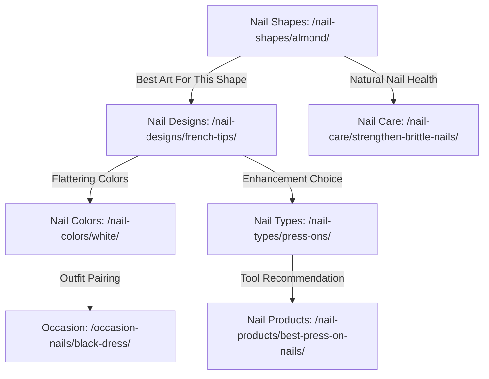

# SEO Content & Keyword Mapping Strategy

**Project:** The Nail Edit (`themaniedit.com`)  
**Primary Entity:** Nails  
**Date:** March 2026  
**Methodology:** Intent-First Architecture (One Page = One Primary Intent), Cannibalization Prevention, Strict Attribute Combination Governance.

---

## 1. Research Methodology & Evidence Grounding

To preserve search engine integrity and user trust:
1. **Supplied Project Research:** Metrics provided from initial competitor audits (ThePinkIssue and Glamnetic generic audits) are explicitly flagged as `Supplied Project Research` and not mislabeled as newly verified live data.
2. **Unverified Live Metrics:** Where live Google search volume, CPC, or real-time keyword difficulty cannot be independently retrieved via API, the field is strictly marked as `Not available`.
3. **Intent Categorization:**
   - **Inspirational (I):** User seeks visual galleries, styling cues, or aesthetic salon references.
   - **Informational (Info):** User seeks explanations, anatomical advice, DIY steps, chemistry, or maintenance tutorials.
   - **Commercial Investigation (C):** User is comparing tools, kits, lamps, or products prior to purchasing.
4. **Action Priorities:**
   - **High:** Critical foundational topic essential for entity authority and core user discovery.
   - **Medium:** Valuable secondary cluster topic with clear distinct search intent.
   - **Low:** Specialized long-tail topic scheduled for later expansion phases.
   - **Section Only:** High-volume or combinatorial keyword that must be integrated as an H2/H3 sub-section inside an authoritative parent page to avoid keyword cannibalization.
   - **Exclude:** Navigational/branded queries, irrelevant niches, or low-quality thin query variants.

---

## 2. Comprehensive Keyword Map Across 8 Silos

| Keyword | Intent | Target URL | Silo | Page Type | Competing URLs / Formats | Priority | Evidence | Notes |
| ------- | ------ | ---------- | ---- | --------- | ------------------------ | -------- | -------- | ----- |
| **nail designs** | Inspirational / Info | `/nail-designs/` | Nail Designs | Silo Pillar | Editorial galleries, listicles (Byrdie, Pinterest) | High | Core Root | Primary hub for manicure art and aesthetic trends. |
| **simple nail designs** | Inspirational | `/nail-designs/simple/` | Nail Designs | Child Article | Listicles, Pinterest pins | High | Search Intent Distinction | Distinct intent for minimal, everyday, beginner-friendly art; distinct from complex avant-garde designs. |
| **french tip nail designs** | Inspirational / Info | `/nail-designs/french-tips/` | Nail Designs | Child Article | Editorial roundups, salon guides | High | Strong Trend Signal | Modern iterations (micro French, colored French, chrome French) represent dedicated search intent. |
| **short nail designs** | Inspirational | `/nail-designs/short-nails/` | Nail Designs | Child Article | Beauty galleries, Reddit communities | High | Search Intent Distinction | Users with short natural beds actively search for designs that fit without extensions. |
| **classy nail designs** | Inspirational | Section Only | Nail Designs | Sub-section | Listicles | Section Only | Cannibalization Risk | Integrate as curated section within `/nail-designs/simple/` and `/nail-designs/` rather than separate thin URL. |
| **cute nail designs** | Inspirational | Section Only | Nail Designs | Sub-section | Pinterest collections | Section Only | Intent Overlap | High overlap with simple & seasonal designs; handle via section tagging. |
| **nail art ideas** | Inspirational | `/nail-designs/` | Nail Designs | Variant | Byrdie, Glamour | Section Only | Variant of Root | Direct synonym of `nail designs`; map directly to the pillar page H2s. |
| **chrome nail designs** | Inspirational / Info | `/nail-designs/chrome/` | Nail Designs | Child Article | NailTok blogs, Allure | Medium | Modern Trend Cluster | Covers glazed donut, metallic silver/gold, aura chrome application techniques. |
| **ombre nail designs** | Inspirational / Info | `/nail-designs/ombre/` | Nail Designs | Child Article | Editorial guides, YouTube tutorials | Medium | Distinct Technique | Dedicated visual interest for French fade (baby boomer) and color gradients. |
| **almond nails** | Informational / Insp | `/nail-shapes/almond/` | Nail Shapes | Child Article | Glamnetic, Byrdie, Marie Claire | High | Supplied Research: 40,500 vol / KD 38 | Most sought-after silhouette; requires shape anatomy, filing guide, and design gallery. |
| **coffin nails** | Informational / Insp | `/nail-shapes/coffin/` | Nail Shapes | Child Article | Glamnetic, Live That Glow | High | Supplied Research: 40,500 vol / KD 31 | Ballerina/coffin silhouette guide; durability, apex building, and length requirements. |
| **squoval nails** | Informational / Insp | `/nail-shapes/squoval/` | Nail Shapes | Child Article | Glamnetic, Byrdie | High | Supplied Research: 12,100 vol / KD 32 | Universally flattering natural nail profile; high intent for DIY home shaping. |
| **square nails** | Informational / Insp | `/nail-shapes/square/` | Nail Shapes | Child Article | Editorial blogs, Pinterest | High | Core Shape Entity | Classic 90s silhouette guide; straight sidewalls, 90-degree corners, stress points. |
| **oval nails** | Informational / Insp | `/nail-shapes/oval/` | Nail Shapes | Child Article | Salon tutorials | High | Core Shape Entity | Natural curve following the eponychium; ideal for weak or short nails. |
| **stiletto nails** | Informational / Insp | `/nail-shapes/stiletto/` | Nail Shapes | Child Article | Fashion editorials | Medium | Core Shape Entity | High-glamour, sharp point; requires acrylic/hard gel reinforcement warnings. |
| **nail shapes guide** | Informational | `/nail-shapes/` | Nail Shapes | Silo Pillar | Editorial infographics | High | Core Root | Comprehensive comparison chart: finger elongation, durability, maintenance. |
| **how to shape almond nails** | Informational | Section Only | Nail Shapes | Sub-section | YouTube, WikiHow | Section Only | Step-by-Step Intent | Host inside `/nail-shapes/almond/` under the H2 "How to File & Shape Almond Nails at Home". |
| **white nails** | Inspirational / Info | `/nail-colors/white/` | Nail Colors | Child Article | ThePinkIssue, Byrdie | High | Supplied Research: 22,200 vol / KD 36 | Covers bright optic white, sheer milky white, chrome glazes, and skin tone undertones. |
| **peach nails** | Inspirational | `/nail-colors/peach/` | Nail Colors | Child Article | ThePinkIssue | High | Supplied Research: 4,400 vol / KD 35 | High aesthetic interest (Pantone Peach Fuzz era); warm spring/summer transition palette. |
| **navy blue nails** | Inspirational | `/nail-colors/navy-blue/` | Nail Colors | Child Article | ThePinkIssue | High | Supplied Research: 5,400 vol / KD 31 | "Quiet luxury" alternative to black; pairs with professional and formal styles. |
| **blue nail designs** | Inspirational | Section Only | Nail Colors | Sub-section | ThePinkIssue | Section Only | Supplied Research: 9,900 vol / KD 33 | Cannibalization alert: integrate as design showcase within `/nail-colors/blue/` or `/nail-colors/navy-blue/`. |
| **hot pink nail designs** | Inspirational | Section Only | Nail Colors | Sub-section | ThePinkIssue | Section Only | Supplied Research: 5,400 vol / KD 24 | Integrate within `/nail-colors/pink/` under the H2 "Vibrant & Hot Pink Manicure Inspo". |
| **dark purple nails** | Inspirational | `/nail-colors/dark-purple/` | Nail Colors | Child Article | ThePinkIssue | Medium | Supplied Research: 5,400 vol / KD 28 | Plum, aubergine, deep blackberry; high intent during autumn/winter cycles. |
| **mauve nails** | Inspirational | `/nail-colors/mauve/` | Nail Colors | Child Article | ThePinkIssue | Medium | Supplied Research: 3,600 vol / KD 30 | Classic dusty rose/purple neutral; everyday corporate and wedding guest staple. |
| **pink cat eye nails** | Inspirational | Section Only | Nail Colors / Designs | Sub-section | ThePinkIssue | Section Only | Supplied Research: 6,600 vol / KD 25 | Magnetic velvet gel finish; incorporate within `/nail-designs/chrome/` or `/nail-colors/pink/`. |
| **black dress and classy nails** | Inspirational / Styling | `/occasion-nails/black-dress/` | Occasion Nails | Child Article | ThePinkIssue, Style blogs | High | Supplied Research: 90,500 vol / KD 38 | High search interest for outfit-matching; explore pairings (crimson, nude, micro-French, gold chrome). |
| **nude nails** | Inspirational | `/nail-colors/nude/` | Nail Colors | Child Article | Byrdie, Vogue | High | Core Color Entity | Undertone matching (cool pink vs. warm olive vs. neutral beige); the quintessential clean manicure. |
| **red nails** | Inspirational | `/nail-colors/red/` | Nail Colors | Child Article | Harper's Bazaar, Allure | High | Core Color Entity | Classic cherry red, Bordeaux, bright crimson; "Red Nail Theory" cultural context. |
| **acrylic nails** | Informational / Guide | `/nail-types/acrylic/` | Nail Types | Child Article | Byrdie, Healthline | High | Core System Entity | Monomer + polymer system; strength, longevity, fill schedules, removal safety. |
| **gel nails** | Informational / Guide | `/nail-types/gel/` | Nail Types | Child Article | Allure, Salon magazines | High | Core System Entity | Hard gel vs. soft gel vs. BIAB (Builder in a Bottle); curing, flexibility, durability. |
| **dip powder nails** | Informational / Guide | `/nail-types/dip-powder/` | Nail Types | Child Article | Real Simple, Glamour | High | Core System Entity | Cyanoacrylate resin + acrylic powder; pros, cons, salon hygiene considerations. |
| **press-on nails** | Commercial / Info | `/nail-types/press-ons/` | Nail Types | Child Article | Glamnetic, Wirecutter | High | Commercial + DIY Intent | Sizing, adhesive tabs vs. resin glue, proper prep for 2+ week wear. |
| **biab nails** | Informational | `/nail-types/biab/` | Nail Types | Child Article | Vogue UK, Grazia | Medium | Fast-Growing UK/Global Trend | Builder in a Bottle natural nail overlays for length retention. |
| **nail types explained** | Informational | `/nail-types/` | Nail Types | Silo Pillar | Comparison tables | High | Core Root | Comprehensive chemistry comparison table: removal method, odor, nail damage risk. |
| **how to strengthen brittle nails** | Informational (Medical/Care) | `/nail-care/strengthen-brittle-nails/` | Nail Care | Child Article | AAD (Dermatology), Healthline | High | High Pain-Point Intent | Evidence-based keratin care, moisture vs. protein balance, biotin facts vs. myths. |
| **cuticle care guide** | Informational | `/nail-care/cuticle-care/` | Nail Care | Child Article | Byrdie, Cleveland Clinic | High | Core Health Topic | Why dermatologists advise against cutting live eponychium; oils, pushers, chemical softeners. |
| **how to remove gel nails at home** | Informational (Tutorial) | `/nail-care/gel-removal/` | Nail Care | Child Article | Byrdie, YouTube | High | Practical DIY Rescue | Acetone foil wrap method, grit files, avoiding scraping plate keratin. |
| **how to fix a broken nail** | Informational (Emergency) | `/nail-care/fix-broken-nail/` | Nail Care | Child Article | Good Housekeeping, Cosmo | Medium | High Utility Intent | Tea bag & resin wrap technique, silk wraps, trimming strategies. |
| **wedding nails** | Inspirational / Styling | `/occasion-nails/wedding/` | Occasion Nails | Child Article | Brides, Martha Stewart Weddings | High | Major Event Cluster | Bridal classics: glazed French, blush nudes, delicate lace art, ring photo tips. |
| **prom nails** | Inspirational | `/occasion-nails/prom/` | Occasion Nails | Child Article | Seventeen, Teen Vogue | Medium | Seasonal Event Cluster | Dress-matching guides, sparkly accents, affordable press-on tips. |
| **work appropriate nails** | Informational / Styling | `/occasion-nails/work-appropriate/` | Occasion Nails | Child Article | The Everygirl, Forbes Vetted | Medium | Professional Intent | Office dress codes, clean short profiles, subtle neutral finishes. |
| **fall nail designs** | Inspirational / Seasonal | `/seasonal-nails/fall/` | Seasonal Nails | Child Article | WhoWhatWear, Allure | High | High Seasonal Demand | Warm earth tones, tortoiseshell, plaid, pumpkin spice shades, matte finishes. |
| **summer nail designs** | Inspirational / Seasonal | `/seasonal-nails/summer/` | Seasonal Nails | Child Article | Glamour, Byrdie | High | High Seasonal Demand | Neon pastels, vibrant coral, fruity nail art, ocean blues, pool-safe formulas. |
| **spring nail designs** | Inspirational / Seasonal | `/seasonal-nails/spring/` | Seasonal Nails | Child Article | Southern Living, Byrdie | High | High Seasonal Demand | Pastels, botanical florals, butter yellow, pistachio green, sheer lilac. |
| **winter nail designs** | Inspirational / Seasonal | `/seasonal-nails/winter/` | Seasonal Nails | Child Article | Elle, Cosmopolitan | High | High Seasonal Demand | Frosted icy glazes, velvet emerald, deep burgundy, metallic silver. |
| **halloween nail designs** | Inspirational / Holiday | `/seasonal-nails/halloween/` | Seasonal Nails | Child Article | Pinterest, PopSugar | Medium | Event Peak (Oct) | Ghost accents, blood drips, gothic spiderwebs, subtle moody noir manicures. |
| **christmas nail designs** | Inspirational / Holiday | `/seasonal-nails/christmas/` | Seasonal Nails | Child Article | Country Living, Byrdie | Medium | Event Peak (Dec) | Tartan plaids, candy cane French, festive crimson glitter, snowflake art. |
| **best press on nails** | Commercial / Guide | `/nail-products/best-press-on-nails/` | Nail Products | Child Article | Glamnetic, NYT Wirecutter | High | Supplied Research: 27,100 vol / KD 34 | Objective spec breakdown: ABS plastic vs. acrylic-infused, sizing kits, longevity. |
| **best uv led nail lamp** | Commercial / Tech Guide | `/nail-products/uv-led-nail-lamps/` | Nail Products | Child Article | Nail technician blogs, Amazon reviews | High | Technical Buyer Guide | Dual wavelength (365nm + 405nm), wattage myths, sensor placement, safe curing. |
| **nail glue guide** | Commercial / Safety | `/nail-products/nail-glue-guide/` | Nail Products | Child Article | Glamnetic, Byrdie | Medium | Practical Buyer Intent | Ethyl cyanoacrylate formulas, brush-on vs. precision tip, damage-free removal. |
| **cuticle oil ingredients** | Informational / Buyer | `/nail-products/cuticle-oil-guide/` | Nail Products | Child Article | Dermatology blogs, Paula's Choice | Medium | Formulation Science | Jojoba oil molecular size (penetrates nail plate), vitamin E, sweet almond oil vs. mineral oil. |
| **glamnetic / glamnetic nails** | Branded / Navigational | N/A | Competitor / Brand | Exclude | Glamnetic.com | Exclude | Branded Search Intent | Third-party commercial brand; exclude branded URLs to avoid trademark conflicts. |

---

## 3. Strict Cannibalization & Attribute Combination Governance

### The "One Page = One Primary Intent" Rule
A distinct URL is granted **only** when search results prove that users are seeking an entirely different content structure, technical format, or decision criteria. Synonyms and aesthetic sub-styles are consolidated into sections on authoritative parent pages.

### Cannibalization Decisions Table

| Candidate Query | Potential Conflict With | Resolution | Structural Action |
| --------------- | ----------------------- | ---------- | ----------------- |
| `nail ideas` & `nail art` | `nail designs` | **Consolidate into Pillar** | Treat `nail ideas` and `nail art` as natural language variations. Use them as H2 headings and intro synonyms on `/nail-designs/`. Do NOT create `/nail-art/` or `/nail-ideas/`. |
| `cute nail designs` | `simple nail designs` | **Merge into Simple Designs** | Users searching "cute" typically want accessible, playful, non-intimidating designs. Feature a "Playful & Cute Accents" H2 section within `/nail-designs/simple/`. |
| `classy nail designs` | `nude nails` & `french tips` | **Section Only** | "Classy" is a subjective modifier. Create an editorial collection section within `/nail-designs/french-tips/` and `/occasion-nails/black-dress/`. |
| `pink almond nails` | `almond nails` vs `pink nails` | **Section Only** | Do NOT build `/pink-almond-nails/`. Feature an "Almond Silhouettes in Pink" styling section inside `/nail-colors/pink/` and link to `/nail-shapes/almond/`. |
| `fall almond nails` | `fall nails` vs `almond nails` | **Section Only** | Do NOT create `/fall-almond-nails/`. In `/seasonal-nails/fall/`, include an H3 on "Best Shapes for Fall Palettes: The Warm Almond". |
| `pink cat eye nails` | `nail designs` vs `pink nails` | **Section Only** | Cat-eye is a magnetic gel finish. Feature as an H3 within `/nail-designs/chrome/` (special effect finishes) or `/nail-colors/pink/`. |
| `blue nail designs` | `navy blue nails` | **Merge into Blue Palette** | A dedicated `/nail-colors/navy-blue/` covers dark tones; broader blue art is showcased as a gallery section inside `/nail-colors/blue/`. |
| `hot pink nail designs` | `pink nails` | **Section Only** | Cover neon/hot pink as an undertone chapter within `/nail-colors/pink/`. |
| `how to file coffin nails` | `coffin nails` | **Section Only** | Embed filing instructions with step-by-step illustrations inside `/nail-shapes/coffin/`. |
| `gel vs acrylic nails` | `/nail-types/` | **Pillar Comparison Matrix** | Answer directly within the authoritative comparison engine on `/nail-types/` rather than creating a thin interstitial page. |

---

## 4. Recommended First Launch Content Set (18 Priority Pages)

The first content set builds the core topical spine of **The Nail Edit**, ensuring every silo has immediate authoritative child content without sprawling into thin pages.

### Silo Breakdown (18 Pages):
* **Nail Designs (3 Pages):**
  1. `/nail-designs/simple/` — Simple, Minimalist & Clean Nail Designs (High Intent, Broad Appeal)
  2. `/nail-designs/french-tips/` — Modern French Tip Nail Designs (Micro, Colored & Chrome)
  3. `/nail-designs/short-nails/` — Short Nail Designs & Flattering Art for Natural Nails
* **Nail Shapes (3 Pages):**
  4. `/nail-shapes/almond/` — Almond Nails: Complete Guide to Shaping, Lengths & Designs (Supplied Vol: 40,500)
  5. `/nail-shapes/coffin/` — Coffin Nails (Ballerina Silhouette): Structure, Sizing & Ideas (Supplied Vol: 40,500)
  6. `/nail-shapes/squoval/` — Squoval Nails: How to Shape & Why It Flatters Every Hand (Supplied Vol: 12,100)
* **Nail Colors (3 Pages):**
  7. `/nail-colors/white/` — White Nails: Milky, Clean White & Glazed Variations (Supplied Vol: 22,200)
  8. `/nail-colors/navy-blue/` — Navy Blue Nails: Sophisticated Midnight & Moody Manicures (Supplied Vol: 5,400)
  9. `/nail-colors/nude/` — Nude Nails: How to Match Your Skin Undertone & Best Clean Shades
* **Nail Types (3 Pages):**
  10. `/nail-types/acrylic/` — Acrylic Nails Guide: Application, Fills, Longevity & Safety
  11. `/nail-types/gel/` — Gel Nails Explained: Hard Gel, Soft Gel & Builder in a Bottle (BIAB)
  12. `/nail-types/press-ons/` — Press-On Nails Guide: Sizing, Prep & Damage-Free Wear
* **Nail Care (2 Pages):**
  13. `/nail-care/strengthen-brittle-nails/` — How to Strengthen Brittle Nails: Dermatologist-Backed Keratin Care
  14. `/nail-care/gel-removal/` — How to Safely Remove Gel Nails at Home Without Damaging Your Plate
* **Occasion Nails (1 Page):**
  15. `/occasion-nails/black-dress/` — Classy Nails for a Black Dress: 12 Elegant Color & Art Pairings (Supplied Vol: 90,500)
* **Seasonal Nails (2 Pages):**
  16. `/seasonal-nails/fall/` — Fall Nail Designs: Cozy Tones, Rich Tortoiseshell & Autumn Textures
  17. `/seasonal-nails/spring/` — Spring Nail Designs: Fresh Pastels, Micro Florals & Butter Yellows
* **Nail Products (1 Page):**
  18. `/nail-products/best-press-on-nails/` — Best Press-On Nails: Evaluation Specs, Fit & Longevity (Supplied Vol: 27,100)

---

## 5. Recommended Next 30 Topics

This sequence expands the topical clusters once the initial 18 pages are indexed and generating engagement signals:

| # | Target Keyword | Search Intent | Target URL | Silo | Why It Deserves a Page | Cannibalization Risk | Priority |
| - | -------------- | ------------- | ---------- | ---- | ---------------------- | -------------------- | -------- |
| 1 | peach nails | Inspirational / Color | `/nail-colors/peach/` | Nail Colors | Strong seasonal transition tone (4,400 supplied vol); specific warm undertone palette. | Low (distinct hue) | High |
| 2 | square nails | Informational / Shape | `/nail-shapes/square/` | Nail Shapes | Foundational geometry; distinct 90-degree filing rules and stress lines. | Low | High |
| 3 | oval nails | Informational / Shape | `/nail-shapes/oval/` | Nail Shapes | Essential natural nail silhouette; gentle on fragile free edges. | Low | High |
| 4 | summer nail designs | Inspirational / Season | `/seasonal-nails/summer/` | Seasonal Nails | High seasonal search spike; beach-proof, neon, and vivid palette requirements. | Low | High |
| 5 | winter nail designs | Inspirational / Season | `/seasonal-nails/winter/` | Seasonal Nails | Frosted glazes, moody jewel tones, holiday velvet art. | Low | High |
| 6 | wedding nails | Inspirational / Event | `/occasion-nails/wedding/` | Occasion Nails | High intent bridal queries; ring photos, dress fabric pairings, sheer neutrals. | Low | High |
| 7 | cuticle care guide | Informational / Health | `/nail-care/cuticle-care/` | Nail Care | Core foundation for nail health; high dermatologist consensus value. | Low | High |
| 8 | uv led nail lamps | Commercial / Hardware | `/nail-products/uv-led-nail-lamps/` | Nail Products | Technical hardware query; nanometer wavelengths, curing safety, wattage specs. | Low | High |
| 9 | chrome nail designs | Inspirational / Art | `/nail-designs/chrome/` | Nail Designs | Persistent multi-year trend (glazed, metallic, mirror); distinct powder application. | Low | High |
| 10 | dip powder nails | Informational / System | `/nail-types/dip-powder/` | Nail Types | Distinct cyanoacrylate powder system requiring safety and removal guidance. | Low | High |
| 11 | dark purple nails | Inspirational / Color | `/nail-colors/dark-purple/` | Nail Colors | Distinct seasonal color palette (5,400 supplied vol); rich plum and blackberry tones. | Low | Medium |
| 12 | mauve nails | Inspirational / Color | `/nail-colors/mauve/` | Nail Colors | Understated corporate/formal neutral (3,600 supplied vol); cool pink-purple blend. | Low | Medium |
| 13 | red nails | Inspirational / Color | `/nail-colors/red/` | Nail Colors | Universal classic color; blue-based vs. orange-based undertone guide. | Low | Medium |
| 14 | stiletto nails | Informational / Shape | `/nail-shapes/stiletto/` | Nail Shapes | Dramatic apex structure; clear separation from almond tips. | Low | Medium |
| 15 | biab nails | Informational / System | `/nail-types/biab/` | Nail Types | High breakout interest for natural nail growth and builder gel overlays. | Low | Medium |
| 16 | ombre nail designs | Inspirational / Art | `/nail-designs/ombre/` | Nail Designs | Distinct vertical & horizontal gradient sponge/airbrush technique. | Low | Medium |
| 17 | how to fix a broken nail | Informational / Rescue | `/nail-care/fix-broken-nail/` | Nail Care | Immediate utility search; tea bag repair method and emergency salon fixes. | Low | Medium |
| 18 | nail glue guide | Commercial / Guide | `/nail-products/nail-glue-guide/` | Nail Products | Practical accessory evaluation; ethyl cyanoacrylate bonds vs. sticky tabs. | Low | Medium |
| 19 | halloween nail designs | Inspirational / Event | `/seasonal-nails/halloween/` | Seasonal Nails | Massive annual Q3/Q4 traffic surge; gothic, dark art, playful themes. | Low | Medium |
| 20 | christmas nail designs | Inspirational / Event | `/seasonal-nails/christmas/` | Seasonal Nails | High Q4 peak; festive red/green, tartan patterns, glitter accents. | Low | Medium |
| 21 | prom nails | Inspirational / Event | `/occasion-nails/prom/` | Occasion Nails | Youth/student event surge; matching dresses, sparkles, low-cost options. | Low | Medium |
| 22 | work appropriate nails | Informational / Event | `/occasion-nails/work-appropriate/` | Occasion Nails | Conservative corporate dress codes; clean manicures, short shapes, sheer shades. | Low | Medium |
| 23 | cuticle oil ingredients | Informational / Product | `/nail-products/cuticle-oil-guide/` | Nail Products | Deep ingredient breakdown: jojoba oil absorption vs. mineral oil occlusives. | Low | Medium |
| 24 | green nails | Inspirational / Color | `/nail-colors/green/` | Nail Colors | Sage, olive, matcha, emerald; steady aesthetic growth across all seasons. | Low | Low |
| 25 | brown nails | Inspirational / Color | `/nail-colors/brown/` | Nail Colors | Espresso, chocolate, mocha; high fall/winter neutral transition appeal. | Low | Low |
| 26 | black nails | Inspirational / Color | `/nail-colors/black/` | Nail Colors | High-contrast chic aesthetic, matte vs. high-gloss, negative space art. | Low | Low |
| 27 | yellow nails | Inspirational / Color | `/nail-colors/yellow/` | Nail Colors | Butter yellow trend, pastel spring tones, joyful summer shades. | Low | Low |
| 28 | birthday nails | Inspirational / Event | `/occasion-nails/birthday/` | Occasion Nails | Fun, celebratory manicures; rhinestones, birthstones, statement nails. | Low | Low |
| 29 | vacation nails | Inspirational / Event | `/occasion-nails/vacation/` | Occasion Nails | Long-wearing tips, chlorine/sunscreen resistant top coats, tropical art. | Low | Low |
| 30 | nail file grit guide | Informational / Tool | `/nail-products/nail-file-grits/` | Nail Products | Technical specification guide: 80/100 (enhancements) vs. 180/240 (natural nails). | Low | Low |

---

## 6. Internal Linking Architecture Between Clusters

To establish topical authority, child content pages link cross-silo according to natural user journey milestones:

* **Shape to Design:** Every shape guide recommends 3 art styles uniquely suited to its silhouette (e.g., Almond → Micro-French).
* **Color to Occasion:** Every color profile links to relevant wardrobe and event guides (e.g., White & Navy → Black Dress & Weddings).
* **Type to Care:** Every artificial nail enhancement guide links to safe removal and plate recovery guides to prevent damage.
* **Product to Type:** Buyer product guides link directly to the underlying technique guides explaining how to use them safely.
